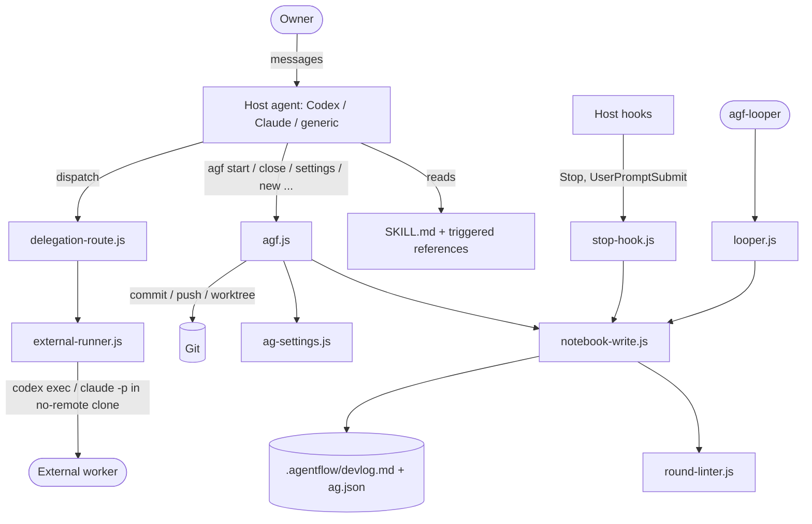
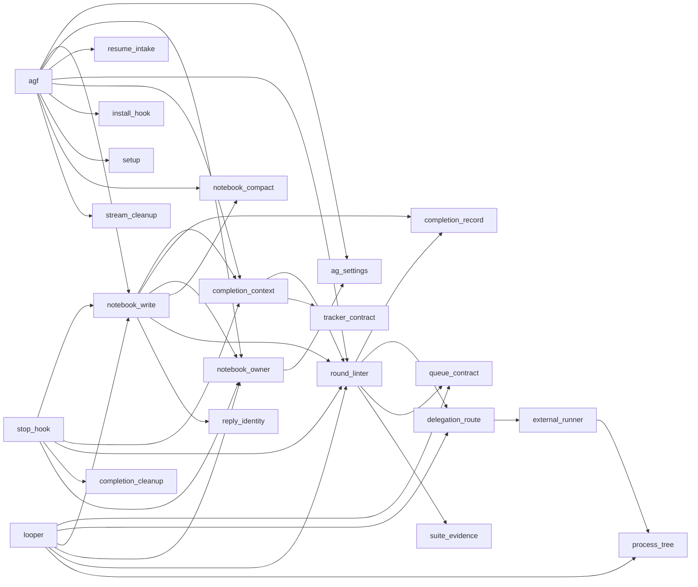

# Architecture

## High-level shape

Agentflow has two halves that must stay consistent:

1. **Instruction layer (Markdown, consumed by an LLM host):** `skills/agentflow/SKILL.md` is always loaded; `references/*.md` and `references/advisors/*.md` load only when a trigger fires (see "Load rules only when triggered" in `SKILL.md`). These files define *policy*: routes, scope discipline, review requirements, Reply format.
2. **Mechanical layer (Node scripts, `skills/agentflow/scripts/`):** deterministic enforcement of that policy — notebook writing, ownership, validation (linter), Git delivery, hooks, worker transport, queue execution. Scripts treat all owner/model text as data, never shell code.

The host agent is the coordinator: it reads the instructions, calls scripts with explicit paths and stdin, and owns decisions. Scripts refuse unsafe or unproven states rather than guessing.

## Module responsibilities (scripts)

**Command surface**
- `agf.js` — unified CLI and orchestration of start, close (validate → replace → commit → push), streams (`new`, `finish --prep/--deliver`, `cleanup`, `ditch`), `init`, `setup`, `hooks`, `settings`, `review`, `uninstall`; delegates `owner`, `compact`, `skills` to other modules. Holds the delivery lock (`acquire_delivery_lock`).
- `looper.js` — standalone sequential plan runner (`agf-looper`), plus interactive-host claim API (`claim_host_plan`, `finish_host_plan`).
- `setup.js` — shell shortcut (`agf()`, `agf-looper()`) detection/installation.
- `install-hook.js` — install/remove Stop + UserPromptSubmit hooks in `.claude/settings.json` or `.codex/hooks.json` (project or global) and the Git pre-commit guard.

**Notebook core**
- `notebook-write.js` — the only notebook writer: append input/RUN/WIP/Reply, `close_round`, `prepare_close_candidate`, locks (`acquire_close_round_lock`), atomic replace, input/close receipts under `<workspace>/.tmp/`.
- `notebook-owner.js` — per-notebook session ownership (`guard`, `verify`, `release`, `inspect`, `transfer`/adopt CLI). Records at `<workspace>/.tmp/agentflow-owner-<sha256>.json`. Record enforcement is gated by the `notebook-ownership` switch (default `off`); the guard/verify context is still required by every writer in both modes.
- `notebook-compact.js` — byte-verified archival of completed rounds into `<basename>.archive.md`.
- `resume-intake.js` — read-only startup intake: STATUS, final Ask, changed paths, `stream_decision`.
- `repository-state.js` — detects `git` vs `plain` folder vs error.

**Validation / evidence**
- `round-linter.js` — host-neutral, no-AI grader of a completed round (`parse_devlog`, `lint_round` aggregating ~30+ ordered checks). Largest module.
- `completion-context.js` — gathers live facts (Git, config, review decision, tracker, transcript) and calls `lint_round` (`collect`, `validate_candidate`).
- `completion-record.js` — review-record validation (`validate_review_record`) and per-Ask completion metadata (`publish_reply`) at `<workspace>/.tmp/.../A-NNN/completion.json`.
- `completion-cleanup.js` — periodic sweep of old completion records (`sweep_completion_records`), run from the Stop hook when enabled.
- `terminal-preflight.js` — manual/recovery wrapper around `lint_round`.
- `cross-check-plan.js` — deterministic review-depth selector (`narrow|targeted|full|skip`).
- `suite-evidence.js`, `tracker-contract.js` — test-suite evidence manifests; tracker template/validation.
- `reply-identity.js` — derives `<model>/<effort>` stamp from the active session transcript only.

**Configuration**
- `ag-settings.js` — schema v8 config: templates per host, validation, v7→v8 migration, atomic writes, STATUS formatting, tier resolution, target-doc rename. Shared by almost every module.

**Delegation / execution**
- `delegation-route.js` — transport-neutral policy: `select_executor_action`, `next_executor_action`, `validate_execution_record`, 3ways debate helpers.
- `external-runner.js` — runs one literal command in a disposable no-remote Git clone with bounded output, timeout, nested-process containment (`run_external_command`, `prepare_clone`, `worker_environment`).
- `process-tree.js` — process table inspection and nested-worker containment.
- `queue-contract.js` — frozen plan queue (`make_plans`, `publish_queue`, `.queue-generation.json` digests, `select_frozen_ready_plans`).

**Streams / Git helpers**
- `stream-cleanup.js` — preflight + recovery copy of local files before worktree removal.
- `default-branch.js` — `resolve_default_branch`.
- `devlog-guard.js` — pre-commit guard blocking root notebook/config staging on a non-default branch.

**Misc**
- `fast-lane.js` (`parse_fast_lane`), `local-time.js` (numeric-offset timestamps), `skills-audit.js` (read-only inventory of installed skills).

## Dependency relationships

Verified from `require()` calls. Several cycles exist and are broken with lazy `require` inside functions (e.g. `notebook-owner.js` ↔ `notebook-write.js`, `notebook-owner.js` → `agf.js`, `stop-hook.js` → `agf.js`).

`ag-settings.js`, `local-time.js`, and `fast-lane.js` are leaf-level utilities used broadly. `ag-settings.js` itself requires `round-linter`, `notebook-write`, and `notebook-owner` lazily for rename/STATUS work.

## Persistence

All state is **files**; there is no database or network service.

| Data | Location | Owner module |
| --- | --- | --- |
| Notebook (tracked) | `target-doc`, default `.agentflow/devlog.md`; streams `<workspace>/features/<taskkey>/<taskkey>.devlog.md` | `notebook-write.js` |
| Archive (tracked) | adjacent `*.archive.md` (`devlog.md` → `devlog.archive.md`, `<key>.devlog.md` → `<key>.archive.md`; see `ag-settings.js:archive_path_for_notebook`) | `notebook-compact.js` |
| Config (tracked) | `ag.json` at root or adjacent to stream notebook | `ag-settings.js` |
| Task artifacts (tracked) | `<workspace>/artifacts/<A-NNN-name>/` (design, tracker, briefs, reports, `planned/`) | host + `queue-contract.js`, `tracker-contract.js` |
| Ownership, input/close receipts, completion records (ignored) | `<workspace>/.tmp/` | `notebook-owner.js`, `notebook-write.js`, `completion-record.js` |
| Looper control files | `.looper.lock`, `.looper-attempt.json`, `.stop.txt` in the queue dir | `looper.js` |
| Delivery lock | `agf-delivery.lock` (Git common dir) | `agf.js` |

Writes are atomic (temp file + rename), guarded by lock files and identity/hash rechecks before replacement (`verify_notebook_unchanged`).

## Integrations and external systems

- **Git CLI** — branches, worktrees (`.worktrees/<taskkey>`), commits with `Agentflow-Close-Id` trailer, non-force push with remote SHA verification.
- **Host CLIs as workers** — `codex exec`, `claude -p` (profiles in `ag.json` `external-workers`), launched only via `external-runner.js`.
- **Host hook systems** — Claude Code `.claude/settings.json`, Codex `.codex/hooks.json`; both use `{hooks: {Stop|UserPromptSubmit: [...]}}` and call `stop-hook.js --host <codex|claude>`.
- **Host transcripts** — read by `reply-identity.js` / `completion-context.js` for Reply stamps and terminal-output checks.
- **Shell rc files** — `setup.js --fix` appends managed `agf()`/`agf-looper()` functions after backup.

## Authorization model

No user auth. "Authorization" means **notebook ownership and owner authority**:
- With `notebook-ownership: on`, one host+session owns the active Ask (`notebook-owner.js:guard`); foreign identities are refused before mutation. With `off` (default), sessions may share the Ask, but conflicting identity, current-Ask changes and policy changes are still refused. Identity comes from `--host/--session`, `AGENTFLOW_SESSION_ID`, or host env vars.
- Takeover (ownership `on`) requires `agf owner adopt` with exact Ask, expected token, and notebook SHA-256.
- Push requires both `delivery.mode: "push"` in the manifest and `--push-authorized`.
- Mutation authority for the agent comes from the owner's Ask text (policy in `SKILL.md` "Scope and evidence"), not enforced by code.

## Background processing

- No daemons. The Stop hook runs synchronously after each host turn and exits `2` to block only on failed completed rounds; it fails open on internal errors.
- `looper.js` is a long-running foreground process that runs plans one at a time, streams child output, and prints milestones every 60 s.
- Completion-record cleanup is opportunistic inside the Stop hook, gated by `completion-cleanup` and its interval.
